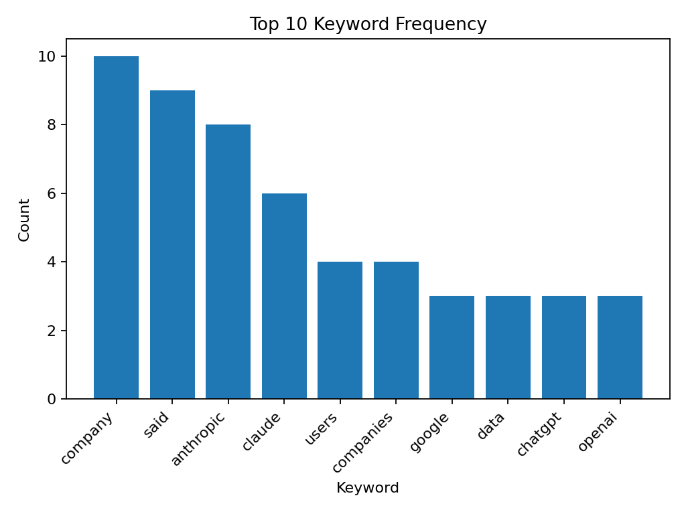
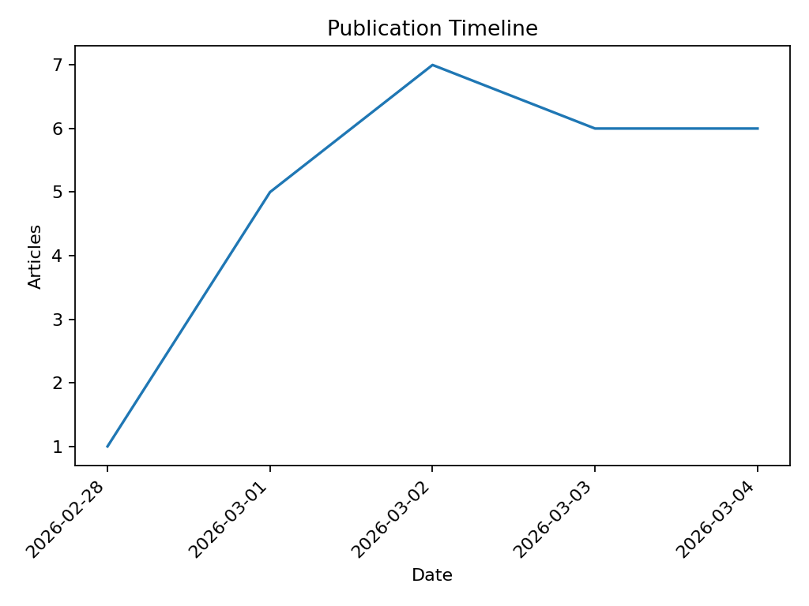

# AI-Powered News Intelligence Pipeline

A Python data pipeline that scrapes technology news, processes the data, enriches it with AI insights, and generates an analytical report with visualizations.

This project was created as a case study to demonstrate skills in:

* Web scraping
* Data processing
* LLM integration
* Data visualization
* Automated reporting

---

# Features

The pipeline performs the following steps:

### 1. News Scraping

* Collects latest articles from **TechCrunch**
* Respects `robots.txt`
* Extracts:

  * title
  * author
  * publication date
  * snippet
  * URL
  * article content

Raw data is saved to:

```
data/raw_news.json
```

---

### 2. Data Processing

The dataset is cleaned and enriched:

* remove duplicates
* normalize text
* keyword extraction
* simple topic categorization:

  * Innovation
  * Policy
  * Finance
  * Market

Processed dataset is saved to:

```
data/processed_news.xlsx
```

---

### 3. AI Enrichment

Each article is analyzed using a **free Hugging Face LLM API**.

The model generates:

* **AI headline**
* **2–3 sentence summary**
* **sentiment classification**

Sentiment values:

```
Positive
Neutral
Negative
```

The results are added to the dataset.

---

### 4. Visualizations

Three charts are automatically generated:

* Sentiment distribution
* Top keyword frequency
* Publication timeline

Charts are saved to:

```
reports/visuals/
```

---

### 5. Automated Report

The pipeline generates an HTML report containing:

* dataset overview
* sentiment statistics
* visualizations
* top AI summaries

Saved to:

```
reports/news_intelligence_report.html
```

---

# Project Structure

```
project/
│
├── main.py                 # pipeline entrypoint
├── scraper.py              # article scraping
├── processor.py            # data processing
├── llm_utils.py            # LLM enrichment
│
├── data/
│   ├── raw_news.json
│   └── processed_news.xlsx
│
├── reports/
│   ├── news_intelligence_report.html
│   └── visuals/
│
├── logs/
│   └── pipeline.log
│
├── requirements.txt
└── README.md
```

---

# Setup

Python **3.11+** recommended.

Create environment:

```
python -m venv .venv
source .venv/bin/activate
```

Install dependencies:

```
pip install -r requirements.txt
```

Download NLTK data:

```
python -c "import nltk; nltk.download('stopwords'); nltk.download('punkt')"
```

---

# Environment Variables

The pipeline uses the Hugging Face **Inference Providers API**.

Create a `.env` file or export variables:

```
HF_TOKEN=your_huggingface_token
HF_PROVIDER=cerebras
HF_GEN_MODEL=meta-llama/Llama-3.1-8B-Instruct
HF_LLM_SLEEP=0.2
```

Notes:

* `HF_PROVIDER` may also be:

  * `hf-inference`
  * `nscale`
  * `nebius`

* `HF_LLM_SLEEP` adds a small delay between API calls.

---

# Running the Pipeline

Basic run:

```
python main.py --topic "AI" --max-articles 25
```

Disable LLM (debug mode):

```
python main.py --topic "AI" --max-articles 25 --no-llm
```

CLI options:

```
--topic          search keyword
--max-articles   number of articles to scrape
--source         news source (currently techcrunch)
--sleep          delay between scraping requests
--no-llm         skip AI enrichment
```

---

# Example Output

### Dataset

```
data/processed_news.xlsx
```

Contains columns such as:

```
title
author
date
keywords
category
ai_headline
ai_summary
sentiment
```

### Visualizations


## Example Visualizations

### Sentiment Distribution


### Keyword Frequency


### Publication Timeline

```

### HTML Report

```
reports/news_intelligence_report.html
```

---

# Logging

Pipeline execution is logged to:

```
logs/pipeline.log
```

Logs include:

* scraping progress
* LLM processing progress
* file outputs
* errors and fallbacks

---

# Notes

* The project intentionally uses **free LLM APIs** to avoid paid services.
* If the AI API fails, the pipeline automatically falls back to deterministic summaries and heuristic sentiment.

---

# Author

Alexander Kiselev
Slovakia
